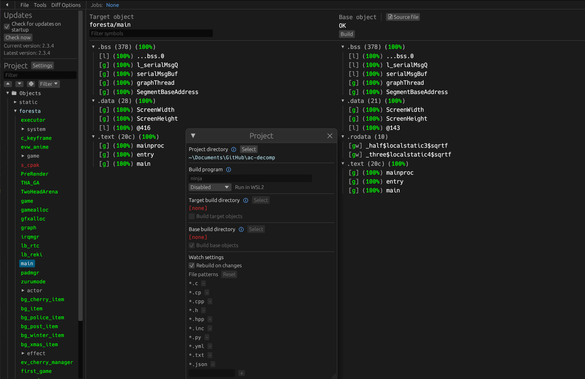

Animal Crossing  
[![Build Status]][actions] ![DOL Progress] ![REL Progress] [![Discord Badge]][discord]
=============

[Build Status]: https://github.com/Prakxo/ac-decomp/actions/workflows/build.yml/badge.svg
[actions]: https://github.com/Prakxo/ac-decomp/actions/workflows/build.yml
[DOL Progress]: https://decomp.dev/ACReTeam/ac-decomp.svg?mode=shield&measure=code&category=dol&label=DOL
[REL Progress]: https://decomp.dev/ACReTeam/ac-decomp.svg?mode=shield&measure=code&category=modules&label=REL
[Discord Badge]: https://img.shields.io/discord/727908905392275526?color=%237289DA&logo=discord&logoColor=%23FFFFFF
[discord]: https://discord.gg/hKx3FJJgrV

A work-in-progress decompilation of Animal Crossing.

This repository does **not** contain any game assets or assembly whatsoever. An existing copy of the game is required.

Supported versions:

- `GAFE01_00`: Rev 0 (USA)

A decompilation of the original N64 version of the game is being worked on [here](https://github.com/zeldaret/af).

<!--
Quick Guides
============

- [Dumping Game Files](./docs/extract_game.md)
- [Ghidra Setup](./docs/ghidra_setup.md)
- [Generating Decomp Context](./docs/generating_decomp_context.md)
- [decomp.me Basics](./docs/decomp_me_basics.md)
- [Ghidra Basics](./docs/ghidra_basics.md)
- [m2c Basics](./docs/m2c_basics.md)
- [Decomp Basics](./docs/decomp_basics.md)
-->

Dependencies
============

Windows
--------

On Windows, it's **highly recommended** to use native tooling. WSL or msys2 are **not** required.  
When running under WSL, [objdiff](#diffing) is unable to get filesystem notifications for automatic rebuilds.

- Install [Python](https://www.python.org/downloads/) and add it to `%PATH%`.
  - Also available from the [Windows Store](https://apps.microsoft.com/store/detail/python-311/9NRWMJP3717K).
- Download [ninja](https://github.com/ninja-build/ninja/releases) and add it to `%PATH%`.
  - Quick install via pip: `pip install ninja`

macOS
------

- Install [ninja](https://github.com/ninja-build/ninja/wiki/Pre-built-Ninja-packages):

  ```sh
  brew install ninja
  ```

- Install [wine-crossover](https://github.com/Gcenx/homebrew-wine):

  ```sh
  brew install --cask --no-quarantine gcenx/wine/wine-crossover
  ```

After OS upgrades, if macOS complains about `Wine Crossover.app` being unverified, you can unquarantine it using:

```sh
sudo xattr -rd com.apple.quarantine '/Applications/Wine Crossover.app'
```

Linux
------

- Install [ninja](https://github.com/ninja-build/ninja/wiki/Pre-built-Ninja-packages).
- For non-x86(_64) platforms: Install wine from your package manager.
  - For x86(_64), [wibo](https://github.com/decompals/wibo), a minimal 32-bit Windows binary wrapper, will be automatically downloaded and used.

Building
========

- Clone the repository:

  ```sh
  git clone --recursive https://github.com/Prakxo/ac-decomp.git
  ```

- Update and Initialize submodules:

  ```sh
  git submodule update --init --recursive
  ```

- Copy your game's disc image to `orig/GAFE01_00`.
  - Supported formats: ISO (GCM), RVZ, WIA, WBFS, CISO, NFS, GCZ, TGC
  - After the initial build, the disc image can be deleted to save space.

- Configure:

  ```sh
  python configure.py
  ```

  To use a version other than `GAFE01_00` (USA), specify it with `--version`.

- Build:

  ```sh
  ninja
  ```

Diffing
=======

Once the initial build succeeds, an `objdiff.json` should exist in the project root.

Download the latest release from [encounter/objdiff](https://github.com/encounter/objdiff). Under project settings, set `Project directory`. The configuration should be loaded automatically.

Select an object from the left sidebar to begin diffing. Changes to the project will rebuild automatically: changes to source files, headers, `configure.py`, `splits.txt` or `symbols.txt`.



Credits
=======

- jamchamb, Cuyler36, NWPlayer123 and fraser125 for past documentation of Animal Crossing.
- SeekyCt for [ppcdis](https://github.com/SeekyCt/ppcdis/) and helping setting up the project.
- msg for helping with *tools/map.py*.
