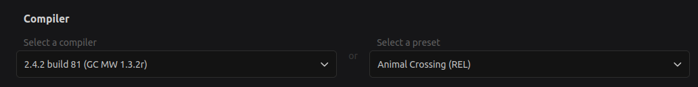

# Decomp.me Basics
[decomp.me](https://decomp.me/) is an online collaborative tool that allows reverse engineers to match functions against the original code and share their progress with others.

## Creating A Scratch
A "scratch" refers to a WIP playground that you can use to iterate on a function or functions until you've reached a match.

In order to create a new scratch, follow the steps below:
1. Open [decomp.me](https://decomp.me/).
2. Login or register for a new account.
3. Click on `New scratch` in the top-right corner of the page.
4. Select `Gamecube/Wii` as the target platform.
5. Under the compiler section select from the "preset" dropdown either `Animal Crossing (REL)` or `Animal Crossing (DOL)` depending on where the function you are reverse engineering is located. For most game-specific code you will using the `REL` option.

6. Copy the assembly for the function you want to match [from the assembly file you generated](decomp_basics.md).
7. Copy the context for the function from the [context file you generated for it](./generating_decomp_context.md).
8. Press the `Create Scratch` button.

## Matching
After your scratch has been created you can begin reverse engineering and writing your own C code. You can use tools such as [m2c](./m2c_basics.md) or [Ghidra](ghidra_basics.md) to help assist you. As you make modifications to your scratch you can see how close you are to matching the function.

Some important notes when matching:
* Variable ordering matters. If you're finding that you're stuck on the last percent or two of a function, try re-arranging the declaration of your variables.
* What you write may affect the assembly the comes before or after it. You may find that as you fill out an earlier/later section that your function matching can increase.
* Only include what you need in your pasted in context. If you include other functions/data you may find that it adds to the "matched" code. In these cases you may need to only forward-declare the respective function(s) and data.