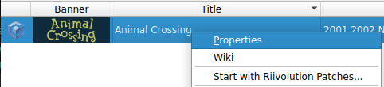
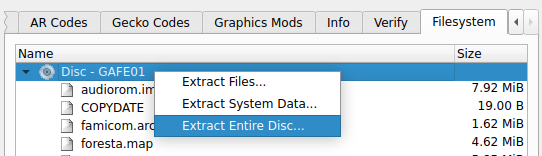

# Game Files Extraction
As this repository does **not** contains any game assets you will first need to extract files from an existing copy of the game.

This repository support the US version of Animal Crossing:
- `GAFE01`: Rev 0 (USA) `sha1: 2d2b1fa3883f49af779ce9ca133db3be17be8f32`

## Dolphin Emulator
Files can be extracted from a copy of the game using [Dolphin Emulator](https://dolphin-emu.org/). Use the following steps to extract the necessary files:

1. Install Dolphin onto your computer.
2. Place your copy of Animal Crossing into your Dolphin game directory.
3. Right-click on the Animal Crossing entry and select "Properties".

4. Select the "File System" tab at the top of the opened dialog.
5. Right-click on the disc.
6. Select "Extract Entire Disc".

7. Select a convenient folder to extract to.

## WIT
Alternatively you can extract the necessary game files using [WIT](https://wit.wiimm.de/). Follow these steps to extract the necessary files:
1. Download the archive appropriate to your OS and architecture.
2. Extract the contents of the archive. Follow the installation instructions included in the `INSTALL.txt` file.
3. Once installed run the following command:

~~~~console
wit EXTRACT <PATH_TO_GAME_COPY> <PATH_TO_OUPUT_FOLDER>
~~~~

## Extracted Files
Once files have been extracted you will need to copy the following files into the `dump/` folder at the root of the repository:
- `main.dol`
- `forest_1st.arc`
- `forest_2nd.arc`
- `foresta.rel.szs`

Make sure to rename `main.dol` to `static.dol`.

You will also need to decompress `foresta.rel.szs` using `yaz0` found in `tools/` using the following command:

~~~~console
yaz0 -d foresta.rel.szs foresta.rel
~~~~

It is recommended that you also copy the following symbol maps for reference:
- `foresta.map`
- `static.map`