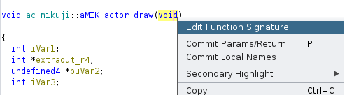
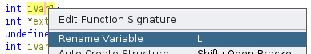
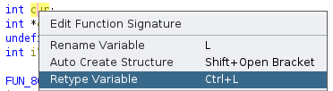
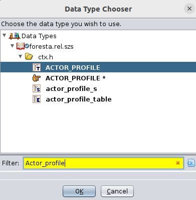

# Ghidra Basics And Tips

## Redefinitions
The following operations require you to have structs and typedefs imported into Ghidra via a [context file](./generating_decomp_context.md) or created manually.

### Editing Function Signatures
You can change the signature of a function inside of Ghidra by right-clicking on a function's name and selecting "Edit Function Signature". Editing the signature allows you to change the return type, and add/edit any arguments that may be missing or incorrect.

### Renaming Variables
When reverse engineering a function it is often helpful to rename variables from their default names to more human-readable names. To do so click on the variable name and then either right-click and select "Rename Variable" or press the `L` key. Type in the new desired name and press "OK".

### Retyping Variables
Ghidra often mistypes variables when first importing and analyzing the game's binary file. As you use Ghidra you can retype variables in order to give you a better and more accurate decompile. To retype a variable, click on the variable's name **NOT** the variables type. Then either right-click and select "Retype Variable" or press `Ctrl + L`.

In the dialog that comes up select the type you want to change to.

### Retyping Data
You can also retype data to known structs by selecting the piece of data's name in the "Listing" view. Then either right-click and choose `Data->Choose Data Type` or press `T`. Select the data type you wish to apply. You may get a warning that it will clear existing data. If you are confident that the selected data type is correct you can click "Yes".

