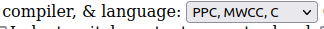

# M2C Basics
m2c is another decompilation tool that can be used to reverse engineer functions. It is avaialbe as both a [web tool](https://simonsoftware.se/other/m2c.html) and also as a [standalone tool](https://github.com/matt-kempster/m2c).

## Using M2C (Web)
In order to use m2c you will need to [generate, and then copy the assembly](./decomp_basics.md) for the function you'd like to reverse engineer and also [generate and copy the context](./generating_decomp_context.md) for the function. When generating context, make sure that the `--m2c` flag is used as m2c does not support preprocessor statements and requires additional cleanup for certain formatting issues. Make sure to delete any unneccesary data or functions if generating context from an in-progress C file.

Below the "Exisiting C Source" section, make sure that the `Compiler and Language` setting is set to `PPC, MWW, C`:

Click on the `Decompile` button and m2c will generate its closests approximation of reverse-engineered C code.

## Hinting Function Arguments
In order to have a slightly more human-readable decompilation generated it is recommended that you forward-declare the function that you are reverse engineering at the bottom of the `Existing C source` section. This just allows `m2c` to more accurately generate C code.

In some cases where "fake" inheritance is used such as with actors, it may be more useful to forward-declare the function with the "inherited" struct argument type (such as `STRUCTURE_ACTOR` instead of just `ACTOR`) so that any struct-specific named variables can be used instead of defaulting to using memory offsets.